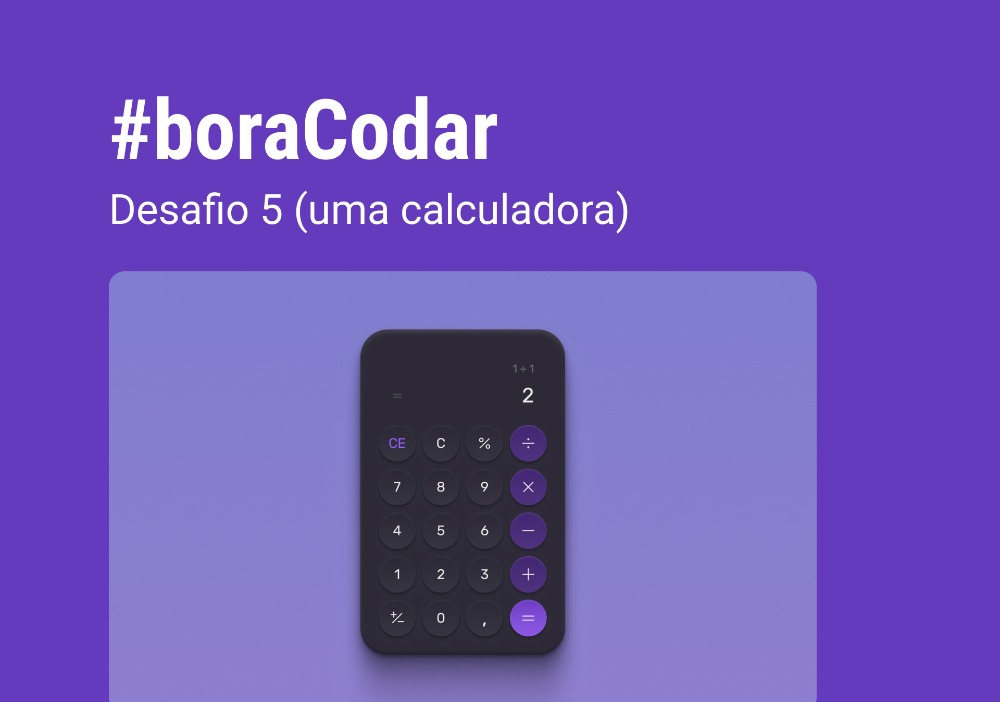

<h1> Calculadora </h1>

 

<h2> O Projeto </h2>

O projeto foi desenvolvido durante os desafios do #BoraCodar da Rocketseat.  

Inicialmente o projeto é apenas um layout de calculadora. Porem, receberá funcionalidade e se tornará interativa, permitindo assim o usuário utilizar para fazer cálculos matemáticos.

  

 

Quer conferir como ficou a calculadora? 

[Visite o projeto online](https://eltonprado.github.io/Projeto10_JogoDaAdivinhacao/)

 

<h2> Tecnologias </h2>

Foi utilizado as seguintes tecnologias para desenvolver esse projeto:

- HTML
- CSS
- Git
- GitHub
